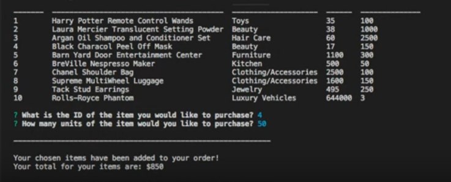
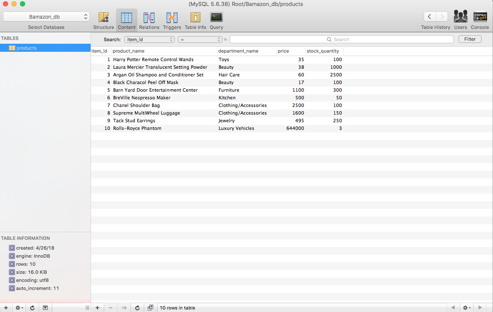

# Bamazon

<h3>What the app does</h3>

Bamazon is a Node Command Line application that is lke a storefront. The app will have a table built in SQL that shows the customer all the options for the products. The customer will see the product name, price, stock quantity, and department name. The app will use inquirer for the cusomer to input their choices. As the customer makes their choices on the backend out stock quantity should be updated as the customer is choosing their items. 

<h3>Technology Used</h3>

<li>SQL</li>
<li>Node.js</li>
<li>JavaScript</li>

<h3>NPM Packages</h3>

<li>SQL</li>
<li>Inquirer</li>
<li>table.console</li>

<h3>Demonstration of App</h3>

Heres a screenshot of the final terminal results

<h3>SQL Table</h3>

In this table it shows the updated stock quantity from when i purchased the 50 Face Mask from iten #4. The original stock was 150 and I purchased 50 in the example and now my SQL table is showing 100. 

